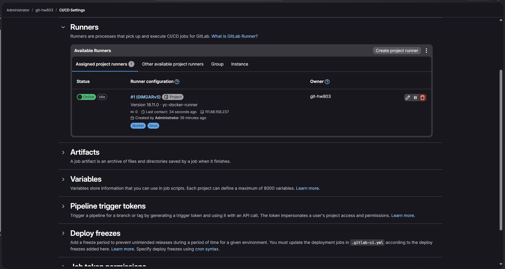
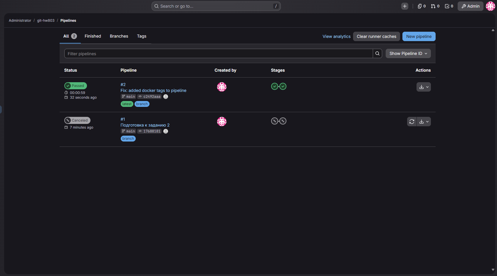
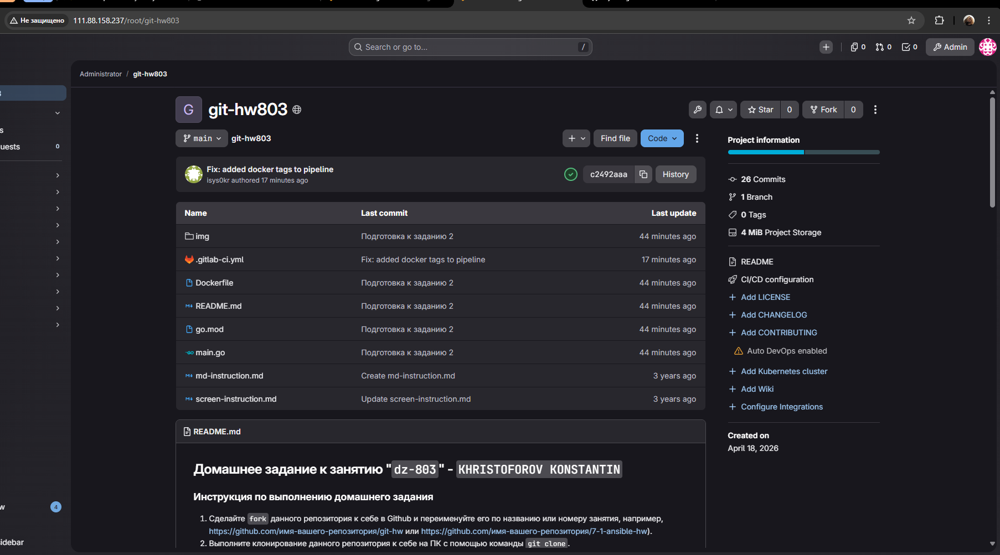

# Домашнее задание к занятию "`dz-803`" - `KHRISTOFOROV KONSTANTIN`


### Инструкция по выполнению домашнего задания

   1. Сделайте `fork` данного репозитория к себе в Github и переименуйте его по названию или номеру занятия, например, https://github.com/имя-вашего-репозитория/git-hw или  https://github.com/имя-вашего-репозитория/7-1-ansible-hw).
   2. Выполните клонирование данного репозитория к себе на ПК с помощью команды `git clone`.
   3. Выполните домашнее задание и заполните у себя локально этот файл README.md:
      - впишите вверху название занятия и вашу фамилию и имя
      - в каждом задании добавьте решение в требуемом виде (текст/код/скриншоты/ссылка)
      - для корректного добавления скриншотов воспользуйтесь [инструкцией "Как вставить скриншот в шаблон с решением](https://github.com/netology-code/sys-pattern-homework/blob/main/screen-instruction.md)
      - при оформлении используйте возможности языка разметки md (коротко об этом можно посмотреть в [инструкции  по MarkDown](https://github.com/netology-code/sys-pattern-homework/blob/main/md-instruction.md))
   4. После завершения работы над домашним заданием сделайте коммит (`git commit -m "comment"`) и отправьте его на Github (`git push origin`);
   5. Для проверки домашнего задания преподавателем в личном кабинете прикрепите и отправьте ссылку на решение в виде md-файла в вашем Github.
   6. Любые вопросы по выполнению заданий спрашивайте в чате учебной группы и/или в разделе “Вопросы по заданию” в личном кабинете.
   
Желаем успехов в выполнении домашнего задания!
   
### Дополнительные материалы, которые могут быть полезны для выполнения задания

1. [Руководство по оформлению Markdown файлов](https://gist.github.com/Jekins/2bf2d0638163f1294637#Code)

---

### Задание 1

`Приведите ответ в свободной форме........`

В связи с техническими ограничениями локального оборудования (отсутствие поддержки вложенной виртуализации для Vagrant/VirtualBox и конфликты пакетов в Debian Trixie), инфраструктура была развернута альтернативным способом на виртуальной машине в Yandex Cloud (Ubuntu 22.04, 4 vCPU, 8 GB RAM).
1. `GitLab CE установлен нативно через Omnibus-пакет (`apt install gitlab-ce`)`
2. `Проект `git-hw803` создан в веб-интерфейсе.`
3. `GitLab Runner зарегистрирован для проекта и запущен в режиме Docker (Docker-in-Docker) на той же ВМ.`
4. `Заполните здесь этапы выполнения, если требуется ....`
5. `Заполните здесь этапы выполнения, если требуется ....`
6. 

```bash
curl -sS https://packages.gitlab.com/install/repositories/gitlab/gitlab-ce/script.deb.sh | sudo bash
sudo EXTERNAL_URL="http://111.88.158.237" apt install gitlab-ce
```
# Регистрация
docker run -ti --rm --name gitlab-runner-register --network host -v /srv/gitlab-runner/config:/etc/gitlab-runner -v /var/run/docker.sock:/var/run/docker.sock gitlab/gitlab-runner:latest register

# Запуск
docker run -d --name gitlab-runner --restart always --network host -v /srv/gitlab-runner/config:/etc/gitlab-runner -v /var/run/docker.sock:/var/run/docker.sock gitlab/gitlab-runner:latest




---

### Задание 2


1. `Репозиторий был склонирован с GitHub на виртуальную машину в Yandex Cloud. Удаленный репозиторий (`origin`) был перенаправлен на локальный инстанс GitLab, развернутый на этой же машине.`
2. `Для запуска пайплайна использовался GitLab Runner, зарегистрированный в режиме Docker executor с пробросом сокета`
3. `Измененен remote URL на адрес локального GitLab`
4. `Заполните здесь этапы выполнения, если требуется ....`
5. `Заполните здесь этапы выполнения, если требуется ....`
6. 

```
Поле для вставки кода...
 git remote set-url origin http://111.88.158.237/root/git-hw803.git
 docker restart gitlab-runner
 git push origin main
```

`При необходимости прикрепитe сюда скриншоты
`



---

